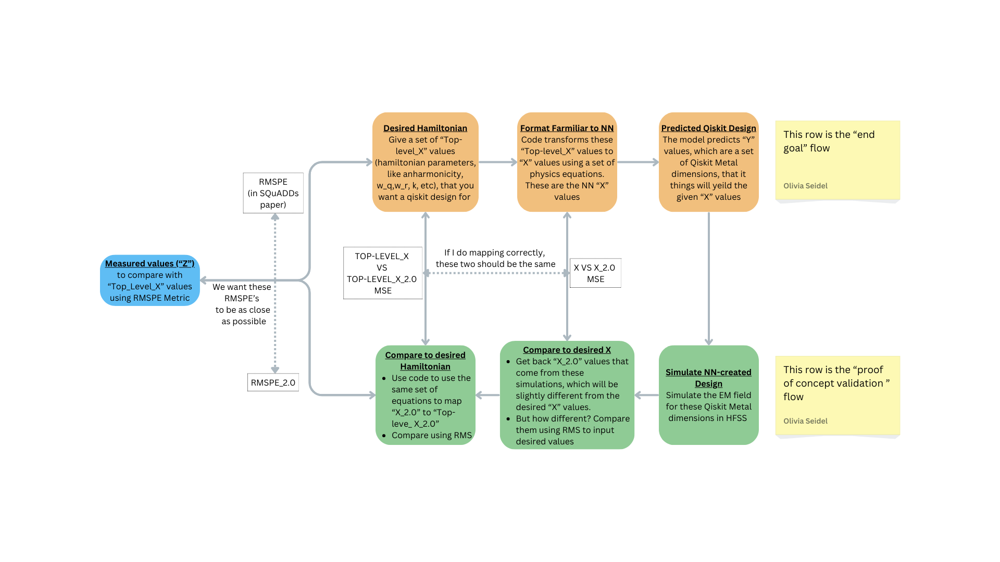

# ML based Qubit Design

This repository contains notebook driven machine learning experiments for predicting Quantum Metal design parameters from target qubit, resonator, coupler, and Hamiltonian quantities.

## Contents

1. Features
2. Contributions
3. Quick Start
4. Structure
5. Experiment Scripts
6. Completed Work
7. Desired Flow

## Features

This repo has tools to experiment with different Multi Layer Perceptron configurations for Quantum Metal parameter prediction when given a desired set of Hamiltonian parameters. The notebooks cover the following options.

1. Hyperparameter optimization

   Compare Keras Tuner searches with predefined hyperparameters.

2. Feature scaling

   Choose whether to scale all features to the range `[0, 1]` or leave them unscaled. Scaling is strongly recommended because the design parameters vary widely in magnitude. Scaling values are saved so predictions can be converted back to physical values later.

3. Categorical data encoding

   Compare one hot encoding with linear encoding for categorical Quantum Metal parameters. Initial experimentation indicates one hot encoding performs better across the board.

## Contributions

Please contact Olivia Seidel at `olivias@fnal.gov` with questions or comments.

Contributors

1. Firas Abouzahr from Northwestern as code contributor and EM validation lead
2. Sara Sussman from Fermilab for ideas and project guidence 

## Quick Start

### Environment Setup

Do this first. See [docs/environment_setup.md](docs/environment_setup.md) for setup notes.

Create the conda environment.

```bash
./scripts/environment/create_conda_env.sh
conda activate cryo-modelling-env
```

Then launch JupyterLab from the repository root.

```bash
jupyter-lab
```

### Fermilab Elastic Analysis Facility setup

A GPU is recommended. If you have a Fermilab services account, you can run Jupyter notebooks on the EAF.

1. Navigate to the [Fermilab EAF docs](https://eafdocs.fnal.gov/master/index.html) and sign in with your credentials.
2. Follow the three Quickstart steps. When the second step opens a new link, enter your credentials again.
3. Click Add New Server.
4. Scroll to the bottom of the server options and choose Fermilab generic notebooks.
5. Select the middle GPU option. From the menu choose the largest slot.
6. Clone this repo there.
7. Create the GPU environment:

```bash
conda env create -f environment-eaf-gpu.yml
conda activate cryo-modelling-env-gpu
```

Please feel free to contribute instructions if you use a GPU somewhere else.

### Large Files

Some model checkpoints and intermediate datasets are too large for GitHub. If you are not planning to rerun all notebooks, parse all data, and retrain all models, download the supplemental files from the shared Google Drive folder.

[Google Drive supplemental files](https://drive.google.com/drive/folders/1WVHR4b4g1M4xdOUghbwNKrABafRz-YaQ?usp=sharing)

The drive contains three directories. Each directory contains a zip file. Unzip each file into its matching folder in your cloned repo. These files are already in `.gitignore`, so you can use the notebooks without committing the large generated artifacts.

If you have access issues, please send a note to `olivias@fnal.gov`.

### Notebooks

After setting up the environment and data, start with the data analysis notebook, then model training, then result inspection.

```bash
conda activate cryo-modelling-env
jupyter-lab
```

### Potential Optimization Strategy

In `parameters.py`, start with `KERAS_TUNER=True`. After the automated hyperparameter search finishes, copy the best values into `parameters.py`. Then rerun with `KERAS_TUNER=False` to inspect how the model learns over the epoch count. You can also increase the number of epochs and fine tune the selected hyperparameters.

## Structure

The main folders contain scripts and notebooks that use machine learning to predict Quantum Metal design parameters from target Hamiltonian or electromagnetic values.

1. `experiments/model_predict_cavity_claw_RouteMeander_eigenmode`
2. `experiments/model_predict_coupler_NCap_cap_matrix`
3. `experiments/model_predict_qubit_TransmonCross_cap_matrix`
4. `experiments/model_predict_qubit_TransmonCross_Hamiltonian_params`

Supporting folders

1. `figures` contains paper figure sources, generation scripts, and checked in outputs.
2. `scripts` contains environment helpers and notebook maintenance utilities.
3. `docs` contains setup notes and static reference images.
4. `environment.yml` defines the conda environment used by the helper scripts.

More detailed folder guides live in [experiments/README.md](experiments/README.md), [figures/README.md](figures/README.md), [scripts/README.md](scripts/README.md), and [docs/README.md](docs/README.md).

## Experiment Scripts

Within each experiment folder, the common notebooks follow this pattern.

1. `ml_00_data_analysis` loads the data and parses it into a model ready format.
2. `ml_01_train_keras` trains the model using an MLP.
3. `ml_03_hyperparameter_search_analysis` plots the hyperparameter search results.
4. `ml_02_print_results` loads a model and makes predictions with it.
5. `ml_10` through `ml_22` notebooks contain surrogate and defined loss variants.
6. `validation` notebooks contain Ansys and downstream validation studies.

Each experiment directory also contains local `parameters*.py` configuration files plus generated CSV and plot outputs that stay next to the notebooks that produced them.

## Completed Work

1. Three main models have been trained with optimized hyperparameters from Keras Tuner.
2. Each model predicts Quantum Metal parameters for parts of a transmon cross chip and resonator design.
3. Encoding values were tested and optimized for categorical output parameters.
4. Scaling techniques were implemented for both inputs and outputs.
5. Training and validation sets were explicitly separated.

## Desired Flow

The desired flow is to stitch the three models together to predict a Quantum Metal design from a set of desired `Top_Level_X` Hamiltonian values. This uses the `X_2.0` values simulated from the `y` values predicted by each individual model.


