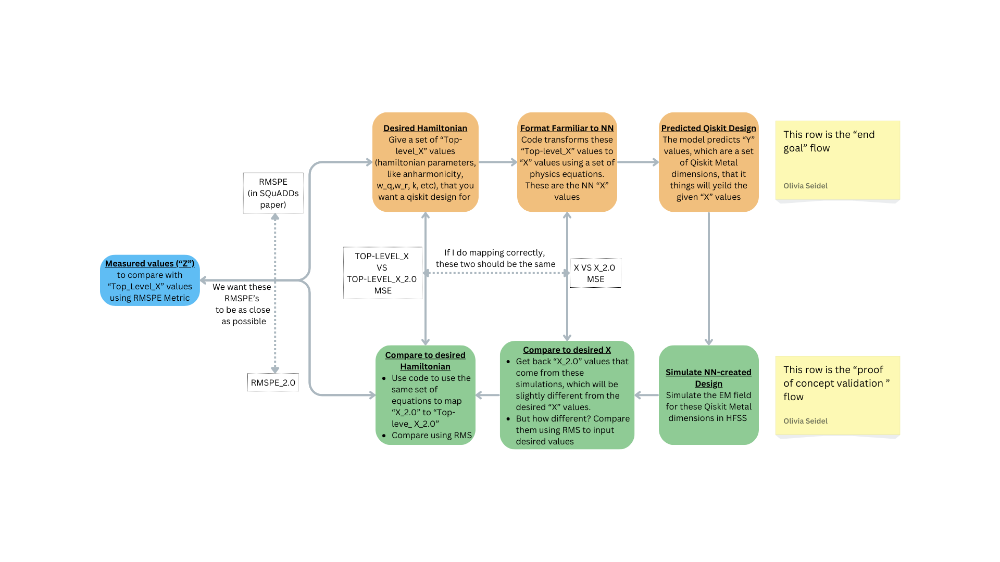

# ML based Qubit Design

## Desired Flow

Below is the desired flow for this project. All three models will be stitched together to predict a Qiskit Metal design when given a set of desired "Top_Level_X" Hamiltonian values. This will be done using the "X_2.0" values that are simulated from the 'y' values predicted with each of the 3 individual models:



## Environment Setup

Do this first. See the [ENV_SETUP](ENV_SETUP.md) documentation.

## Data Setup

Do this second :-) 

See the documentation in the [data](data) directory.

## Quick Start

If you have set up the environment and data, then move to the data analysis notebook (`00_`), then the model training (`01_`), etc.

To open your JupyterLab and then the notebooks:

```
conda activate qubit-design-env
jupyter-lab
```
